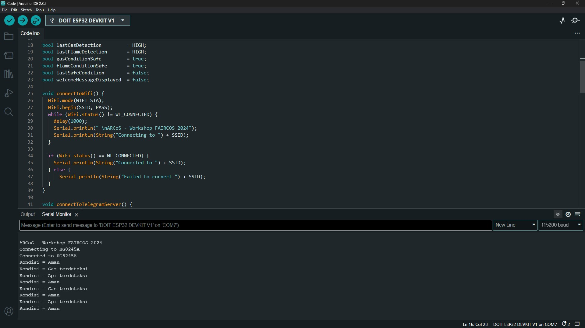

# 🖧 Sistem Monitoring Kebakaran dan Asap dengan Notifikasi Telegram Berbasis ESP32

## Deskripsi proyek
Proyek ini adalah sistem IoT yang dirancang untuk mendeteksi keberadaan api dan asap di lingkungan sekitar secara real-time menggunakan mikrokontroler ESP32. Sistem ini memanfaatkan sensor flame dan sensor asap (MQ-2) untuk mendeteksi kebakaran secara dini. Ketika terdeteksi adanya api atau asap dalam ambang batas tertentu, sistem akan secara otomatis mengirimkan peringatan melalui Telegram bot kepada pengguna.

## 🔌 Hardware yang Digunakan
- 1x ESP32 Devkit V1
- 1x Flame Sensor
- 1x MQ 2 Sensor
  
## 💻 Software yang Digunakan
- Arduino IDE
- Telegram

## ⚙️ Konfigurasi Pin
|    ESP32   | Flame Sensor| MQ 2 Sensor |
|:----------:|:-----------:|:-----------:|
|     Vin    |       -     |     VCC     |
|     GND    |       -     |     GND     |
|     3V     |      VCC    |      -      |
|     GND    |      GND    |      -      |
|     D35    |       -     |     DO      |
|     D34    |      DO     |      -      |

## 📘 Skematik Rangkaian


## 🚀 Memulai Proyek

### 1. Clone Repository

```bash
git clone https://github.com/muhammadghalib/Sistem-Monitoring-Kebakaran-dan-Asap-dengan-Notifikasi-Telegram-Berbasis-ESP32.git
```

### 2. Install Library

Buka file txt yang ada di direktori `arduino-libraries/` pada repository ini dan download semua librarynya ke dalam folder **libraries Arduino** di perangkat Anda.

### 3. Mendapatkan Chat ID Telegram
1. Buka aplikasi Telegram.
2. Cari bot bernama `@IDBot`.
3. Mulai percakapan dengan bot tersebut dan ketik `/start`.
4. Bot akan mengirim pesan yang berisi informasi ID akun Anda.
5. Salin `Chat ID` tersebut lalu simpan untuk digunakan pada tahap selanjutnya.

### 4. Membuat Bot Telegram
1. Buka aplikasi Telegram
2. Cari bot bernama `@BotFather`.
3. Mulai percakapan dengan bot tersebut dan ketik `/start`.
4. Kirim perintah `/newbot`.
5. Masukkan nama bot, contoh :
    ```
    Workshop Faircos2024 Tes
    ```
6. Masukkan username bot dengan format harus diakhiri dengan bot, contoh :
    ```
    WorkshopFaircos2024Tes_bot
    ```
7. `@BotFather` akan memberikan `Bot Token` Anda.
8. Salin `Bot Token` tersebut lalu simpan untuk digunakan pada tahap selanjutnya.

### 5. Menyiapkan dan Mengunggah Sketch
1. Buka file berikut di Arduino IDE atau editor yang Anda gunakan:  
    ```bash
    Code.ino
    ```
2. Sesuaikan konfigurasi berikut pada baris kode:
    - **Baris ke-6**: Masukkan Bot Token dari langkah ke-3, contoh :
      ```c++
      #define BOTtoken "123456789:AAE-xxxxx"
      ```
    - **Baris ke-7**: Masukkan Chat ID dari langkah ke-4, contoh :
      ```c++
      #define CHAT_ID "123456789"
      ```
    - **Baris ke-7**: Masukkan SSID dari WiFi anda, contoh :
      ```c++
      char SSID[] = "myWifi";
      ```
    - **Baris ke-7**: Masukkan Password dari WiFi anda, contoh :
      ```c++
      char PASS[] = "123456789";
      ```
3. Setelah semua konfigurasi selesai, sambungkan ESP32 ke komputer dan unggah sketch ke perangkat.

### 6. Tampilan Serial Monitor


### 7. Tampilan Telegram


## 💡 STAY CURIOUS
